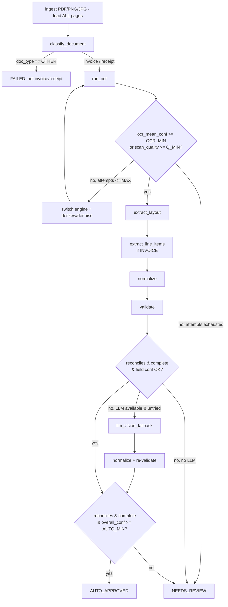

# Agentic AI Component

> **Project #4 — Invoice & Receipt Processing System** · Package `invoice_ai` · Author: Le Dinh Minh Quan (23127460)
> Assignment §7 — the agent that turns raw invoice/receipt images and PDFs into validated, normalized structured JSON with per-field confidence and a `needs_review` flag.

This document specifies the **agentic** layer of the system: a **deterministic state machine** operating over a shared **blackboard**, augmented by an **optional LLM-vision "brain"** that is feature-flagged and isolated. The default path runs **fully offline with no paid API** — uncertain documents go to human review rather than mandatory cloud escalation. This is precisely what lets the system **strictly dominate** the reference implementation (`ruizguille/invoice-processing`), whose entire GPT-4o-vision approach is available here as one optional tool.

---

## 1. Architecture overview — blackboard + planner

The agent is **not** an LLM prompt loop. It is a stateful planner whose policy is a deterministic **rules engine** (the default) with an optional LLM brain. All seven tools read from and write to one shared `AgentState` object — the **blackboard** — so the entire run is reproducible and auditable via a step `trace`.

```
                          ┌──────────────────────────────────────────────┐
                          │                AGENT (planner)                │
                          │   policy: rules engine  |  optional LLM brain │
                          └──────────────────────────────────────────────┘
   input doc                         │ reads/writes
 (PDF/PNG/JPG) ─────►  ┌─────────────▼─────────────┐
                       │        AgentState         │  (single shared blackboard)
                       └─────────────┬─────────────┘
        ┌───────────────┬────────────┼─────────────┬───────────────┬───────────────┐
        ▼               ▼            ▼              ▼               ▼               ▼
  classify_document   run_ocr   extract_layout  extract_line_   validate      normalize
  (invoice/receipt/  (text +    (LayoutLMv3 →   items          (reconcile,   (ISO dates,
   other + quality)  conf/box)   header fields) (table → rows)  date/num/cur) Decimal, cur)
                                                          │
                                                          ▼
                                            [optional] llm_vision_fallback
                                                          │
                              ┌───────────────────────────┴──────────────────────┐
                              ▼                                                    ▼
                       AUTO-APPROVE  (high conf + reconciled)            HUMAN REVIEW (flagged)
```

Three explicit **decision points** govern routing: **D1** doc-type/quality (with OCR retry), **D2** validation (LLM-fallback-or-human-review), and **D3** the final confidence gate (auto-approve vs review). They are detailed in §4.

---

## 2. The blackboard — `AgentState` and its dataclasses

Every tool mutates and returns one shared object. `FieldValue` carries provenance (`source` + `bbox`) so the review UI can highlight the exact pixels behind each prediction; `ValidationReport` carries the arithmetic verdict that the reference implementation lacks entirely.

```python
from dataclasses import dataclass, field
from decimal import Decimal
from enum import Enum
from typing import Any

class DocType(str, Enum):
    INVOICE="invoice"; RECEIPT="receipt"; OTHER="other"; UNKNOWN="unknown"

class Status(str, Enum):
    NEW="new"; ROUTED="routed"; OCR_DONE="ocr_done"; EXTRACTED="extracted"
    VALIDATED="validated"; NORMALIZED="normalized"
    AUTO_APPROVED="auto_approved"; NEEDS_REVIEW="needs_review"; FAILED="failed"

@dataclass
class FieldValue:
    value: Any
    confidence: float           # 0..1 from model softmax / OCR / rule
    source: str                 # "layoutlmv3"|"donut"|"ocr"|"llm"|"rule"
    bbox: tuple | None = None   # provenance for the review UI

@dataclass
class LineItem:
    description: FieldValue
    quantity:   FieldValue | None
    unit_price: FieldValue | None
    amount:     FieldValue                 # line total

@dataclass
class ValidationReport:
    reconciles: bool                       # sum(lines)+tax ≈ total
    reconcile_delta: Decimal               # total - (subtotal + tax)
    checks: dict[str, bool]                # date_valid, invoice_no_plausible, currency_detected, ...
    missing_required: list[str]
    low_confidence_fields: list[str]
    errors: list[str]

@dataclass
class AgentState:
    doc_path: str
    page_images: list = field(default_factory=list)
    doc_type: DocType = DocType.UNKNOWN
    doc_type_conf: float = 0.0
    scan_quality: float = 0.0              # 0..1 blur/skew/resolution heuristic
    ocr_text: str = ""
    ocr_tokens: list = field(default_factory=list)   # [{text,bbox,conf}]
    ocr_mean_conf: float = 0.0
    ocr_engine: str = "tesseract"
    fields: dict[str, FieldValue] = field(default_factory=dict)
    line_items: list[LineItem] = field(default_factory=list)
    validation: ValidationReport | None = None
    normalized: dict[str, Any] = field(default_factory=dict)
    currency: str | None = None
    status: Status = Status.NEW
    overall_confidence: float = 0.0
    review_reasons: list[str] = field(default_factory=list)
    attempts: dict[str, int] = field(default_factory=dict)
    used_llm_fallback: bool = False
    trace: list[dict] = field(default_factory=list)   # step log for audit
```

---

## 3. The seven tools (all `state -> state`)

Each tool is a pure-ish transition that mutates and returns the blackboard. **No tool requires a paid API except the isolated, optional `llm_vision_fallback`.**

| # | Tool | Reads | Writes | How |
|---|------|-------|--------|-----|
| 1 | **`classify_document`** | `doc_path`, `page_images` | `doc_type`, `doc_type_conf`, `scan_quality` | LayoutLMv3-seq or logistic over OCR keywords ("invoice"/"tax invoice" vs "receipt"/"change due"/"POS"); `scan_quality` from Laplacian-variance blur + skew + DPI |
| 2 | **`run_ocr`** | `page_images` | `ocr_text`, `ocr_tokens[{text,bbox,conf}]`, `ocr_mean_conf`, `ocr_engine` | Digital PDF → native text layer (conf≈1.0, exact bboxes); else Tesseract / PaddleOCR. **Re-runnable with a different engine on retry** |
| 3 | **`extract_layout`** | `ocr_tokens`, `page_images` | `fields = {invoice_number, invoice_date, issuer, recipient, subtotal, tax_rate, tax, total, ...}` | Fine-tuned LayoutLMv3 (`S-`/BIO tags) or Donut; confidence = mean softmax over the field's tokens |
| 4 | **`extract_line_items`** | `ocr_tokens` | `line_items=[LineItem(description, quantity, unit_price, amount)]` | Row/col clustering on bboxes + per-cell typing. `qty` & `unit_price` make per-line math checkable — **the reference lacked this** |
| 5 | **`validate`** | `fields`, `line_items` | `validation: ValidationReport` | **The heart of the agent — pure rules, no API.** Checks in §3.1 |
| 6 | **`normalize`** | `fields` | `normalized`, `currency` | Pure, no API: dates → ISO-8601 `YYYY-MM-DD` (`dateutil` + locale hints); amounts → `Decimal(str(x))` 2dp; currency → ISO-4217 |
| 7 | **`llm_vision_fallback`** | `page_images`, `validation` | corrected `fields` / `line_items`, `used_llm_fallback=True` | **OPTIONAL escalation — the only cloud tool.** Exactly the reference's GPT-4o-vision call, demoted to a fallback. **Guard:** no API key → tool unavailable → agent proceeds to HUMAN REVIEW. System stays fully functional offline |

### 3.1 `validate` checks (pure rules, no API)

- **reconcile:** `sum(item.amount) == subtotal (±ε)`; `subtotal + tax == total (±ε)`; also `tax ≈ subtotal * tax_rate` if `tax_rate` present.
- **per_line:** `quantity * unit_price == amount (±ε)` when both present.
- **date_valid:** parseable & plausible (not future > today, not absurdly old); ambiguous dd/mm vs mm/dd flagged.
- **invoice_no:** plausible pattern (alnum, optional separators, len 3..20).
- **currency:** a symbol/ISO code detected (£/€/$/USD/EUR/VND ...).
- **required_present:** `invoice_number, invoice_date, total, issuer` all non-null.
- **confidence:** collect any field with `conf < FIELD_CONF_MIN`.
- **ε (epsilon):** `max(0.01, 0.005 * total)` — tolerate rounding/penny diffs without masking real discrepancies.

---

## 4. The three decision points

| # | Where | Condition | Action |
|---|-------|-----------|--------|
| **D1** | after `classify_document` | `doc_type == OTHER` | stop → route out (not an invoice/receipt) |
| | | `scan_quality < Q_MIN` **or** `ocr_mean_conf < OCR_MIN` | retry: rescan / switch OCR engine (paddle↔tesseract) / deskew; after `MAX_OCR_ATTEMPTS` → **HUMAN REVIEW** |
| **D2** | after `validate` | `not reconciles` **OR** `missing_required` **OR** any required field `conf < FIELD_CONF_MIN` | if LLM fallback available & not tried → escalate, re-validate; else → **HUMAN REVIEW** with reasons |
| **D3** | final gate | `reconciles AND no missing_required AND overall_confidence ≥ AUTO_MIN` | **AUTO-APPROVE** |
| | | otherwise | **HUMAN REVIEW** (attach reasons + bboxes for the UI) |

**Thresholds (config, tunable):** `Q_MIN=0.45`, `OCR_MIN=0.70`, `FIELD_CONF_MIN=0.80`, `AUTO_MIN=0.85`, `MAX_OCR_ATTEMPTS=2`, and `ε = max(0.01, 0.005 * total)`.

**Conservative confidence bottleneck:**
```
overall_confidence = min(doc_type_conf, ocr_mean_conf, min(required-field confidences))
```
A single shaky required field blocks auto-approval — exactly the safe-by-default behavior an accounting pipeline needs.

---

## 5. Control loop



### 5.1 Pseudocode

```python
def run_agent(doc_path: str, cfg: Config) -> AgentState:
    s = AgentState(doc_path=doc_path)
    s.page_images = load_pages(doc_path)            # ALL pages, not just page 1

    # D1: route by doc type + quality
    s = classify_document(s)
    if s.doc_type == DocType.OTHER:
        return finish(s, Status.FAILED, reason="not an invoice/receipt")

    # D1: OCR with quality gate + retry
    engine = "native_pdf" if is_digital_pdf(doc_path) else cfg.default_ocr
    while True:
        s = run_ocr(s, engine=engine)
        if s.ocr_mean_conf >= cfg.OCR_MIN or s.scan_quality >= cfg.Q_MIN:
            break
        s.attempts["ocr"] = s.attempts.get("ocr", 0) + 1
        if s.attempts["ocr"] > cfg.MAX_OCR_ATTEMPTS:
            s.review_reasons.append(f"low OCR confidence ({s.ocr_mean_conf:.2f}); rescan recommended")
            return finish(s, Status.NEEDS_REVIEW)
        engine = next_engine(engine)                # tesseract -> paddleocr -> deskew+retry
        s = preprocess_image(s)                     # deskew/denoise/upscale

    # extraction (route schema by doc type)
    s = extract_layout(s)
    if s.doc_type == DocType.INVOICE:
        s = extract_line_items(s)                   # receipts: line items optional

    # D2: normalize-then-validate
    s = normalize(s)
    s = validate(s)
    needs_help = (not s.validation.reconciles
                  or s.validation.missing_required
                  or s.validation.low_confidence_fields)
    if needs_help and cfg.llm_fallback_enabled and llm_available() and not s.used_llm_fallback:
        s = llm_vision_fallback(s)                  # OPTIONAL cloud escalation
        s = normalize(s); s = validate(s)
        needs_help = (not s.validation.reconciles
                      or s.validation.missing_required
                      or s.validation.low_confidence_fields)

    # D3: final confidence gate
    s.overall_confidence = compute_overall_conf(s)
    if (s.validation.reconciles and not s.validation.missing_required
            and s.overall_confidence >= cfg.AUTO_MIN):
        return finish(s, Status.AUTO_APPROVED)

    if not s.validation.reconciles:
        s.review_reasons.append(
            f"totals don't reconcile: total={s.fields['total'].value} "
            f"vs subtotal+tax off by {s.validation.reconcile_delta}")
    s.review_reasons += [f"missing: {m}" for m in s.validation.missing_required]
    s.review_reasons += [f"low confidence: {f}" for f in s.validation.low_confidence_fields]
    return finish(s, Status.NEEDS_REVIEW)
```

`finish()` stamps `status`, appends to `trace`, and returns state to the caller (the review-queue writer or the auto-post-to-ledger writer). Batch mode wraps `run_agent` in an async-gather loop.

---

## 6. Worked example — totals don't reconcile → flagged for review

**Input:** `INV-2024-077.pdf`, a clean digital-PDF invoice.

| Line | Description | Qty | Unit price | Amount |
|---|---|---|---|---|
| 1 | Consulting services | 10 | 150.00 | 1,500.00 |
| 2 | Onboarding setup | 1 | 300.00 | 300.00 |

Header: `subtotal=1,800.00`, `tax_rate=20%`, `tax=360.00`, **`total=1,860.00`** (the printed total is itself wrong on the document), `invoice_number="INV-2024-077"`, `invoice_date="2024-11-03"`, `currency=GBP`. All field confidences ≥ 0.90.

**Trace:**

1. `classify_document` → INVOICE, conf 0.97, scan_quality 0.92. **(D1: pass.)**
2. `run_ocr` → engine `native_pdf`, `ocr_mean_conf=0.99`. **(D1 gate: pass, no retry.)**
3. `extract_layout` + `extract_line_items` → fields + 2 line items.
4. `normalize` → date already ISO; amounts → Decimal; currency → GBP.
5. `validate`:
   - per-line: 10×150.00 = 1,500.00 ✓; 1×300.00 = 300.00 ✓
   - `sum(lines) = 1,800.00 == subtotal 1,800.00` ✓
   - `tax: 1,800.00 × 20% = 360.00 == tax 360.00` ✓
   - **reconcile total:** expected `subtotal + tax = 2,160.00`; document `total = 1,860.00`; `reconcile_delta = −300.00`; `ε = max(0.01, 0.005 × 1,860) = 9.30`; `|−300.00| > 9.30` → **`reconciles = False`**.
   - date_valid ✓, invoice_no ✓, currency ✓, required_present ✓.
6. **D2:** `needs_help = True`. If LLM fallback is enabled, it re-reads the same printed `1,860.00` (the document is genuinely inconsistent) → re-validation **still fails**. If no key, the step is skipped — same outcome.
7. **D3:** `reconciles == False` → **not auto-approved.**
8. `finish(NEEDS_REVIEW)` with `review_reasons = ["totals don't reconcile: total=1860.00 vs subtotal+tax=2160.00 (off by -300.00)"]`. The review payload carries every field's `bbox`, so the UI highlights the printed total and the two line items for a 5-second human confirmation.

### 6.1 Contrast with the reference

`ruizguille`'s pipeline would `Invoice(**data)` successfully (1,860.00 is a valid float), write `Total=1860.00` into Excel, and **silently** add £1,860 to revenue and £360 to the tax summary — the £300 discrepancy vanishes into the aggregates. Our agent **catches it and routes to a human**. That arithmetic reconciliation, combined with Decimal money, multi-page handling, per-field confidence, and offline operation, is the core value-add and the basis for the strict-dominance claim.

---

## 7. Why this is "agentic" (and offline-first)

- **Stateful, not linear:** a single blackboard (`AgentState`) plus a planner with three branching decision points — versus the reference's linear `PDF → LLM → Excel` script.
- **Tool-using:** seven discrete `state -> state` tools the planner sequences and **re-invokes** (e.g. `run_ocr` with a switched engine on a failed quality gate).
- **Self-checking:** the `validate` tool gives the agent an internal arithmetic truth signal, so it can *decide* to escalate or defer to a human instead of emitting unchecked output.
- **Graceful degradation:** the LLM-vision brain is feature-flagged and isolated; with the network unplugged, uncertain documents degrade to **human review** rather than hard-failing. The system never depends on a paid API to function — the guarantee that makes it strictly dominate an online-mandatory reference.
