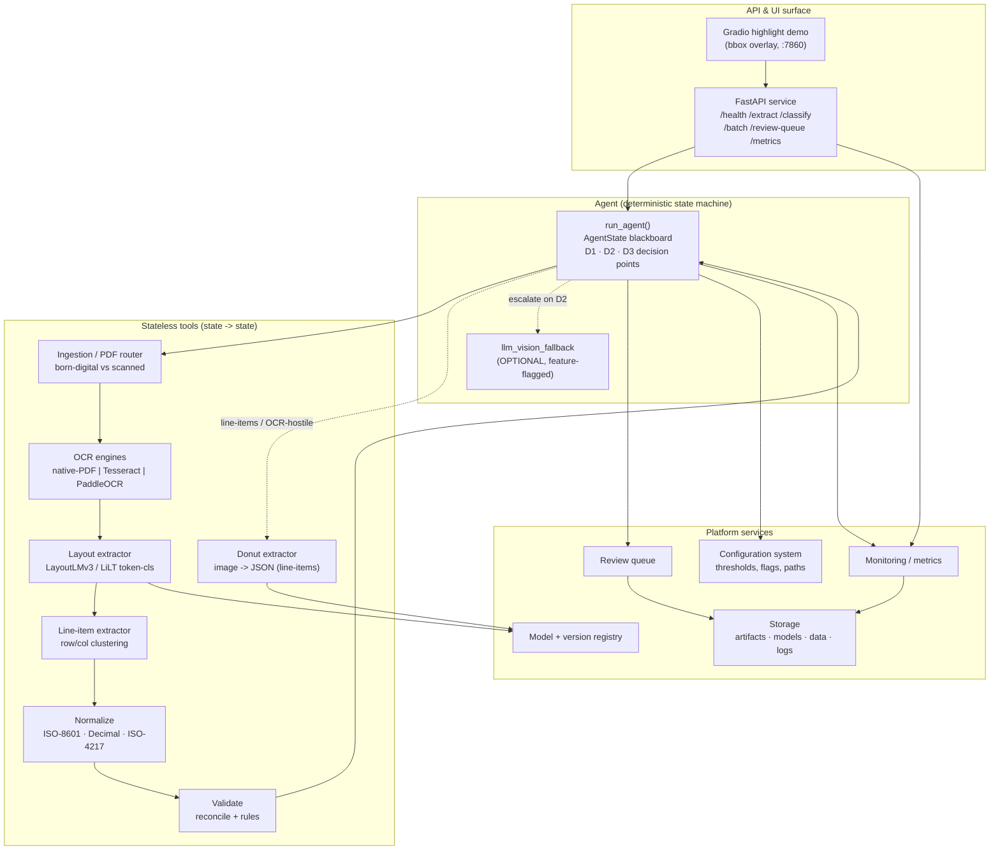

# System Architecture

> **Project #4 — Invoice & Receipt Processing System** · Package `invoice_ai` · Author: Le Dinh Minh Quan (23127460)
> Offline-first Document-AI Key-Information-Extraction (KIE): image/PDF → validated, normalized structured JSON with per-field confidence, bounding boxes, and a `needs_review` flag. Runs fully offline; the cloud LLM-vision call is one optional, feature-flagged fallback tool.

This document describes the static structure of the system: its components and their responsibilities, the data-flow for the three runtime modes (extract / batch / training), the model registry and configuration system, and the mapping from logical components onto the `src/invoice_ai` Python package.

---

## 1. Component overview

The system is layered: a thin **API/UI surface** sits over a deterministic **agent state machine**, which orchestrates **stateless tools** (OCR, extractors, validation, normalization) backed by a **model registry** and a **configuration system**. Cross-cutting **monitoring**, **storage**, and a **review queue** observe every run. The agent never *requires* the network — uncertain documents degrade to human review rather than mandatory cloud escalation.



### 1.1 Component responsibility table

| Component | Responsibility | Key contracts |
|---|---|---|
| **Ingestion / PDF router** | Load image or PDF; render all pages at 200–300 DPI; decide born-digital (text layer via `pdfplumber`/PyMuPDF) vs scanned (rasterize + OCR). Auto-orient (EXIF), optional deskew. | In: `doc_path`. Out: `page_images`, per-page text-layer flag. Fixes reference's "rasterize everything, page-1-only" waste. |
| **OCR engines** | Words + boxes + per-token confidence. Native-PDF text layer first (conf≈1.0, exact boxes); else Tesseract (born-digital default) or PaddleOCR (primary, robust). Re-runnable with a different engine on retry. | Out: `ocr_tokens[{text,bbox,conf}]`, `ocr_mean_conf`, `ocr_engine`. Boxes normalized 0–1000 downstream. |
| **Layout extractor** | Header fields via fine-tuned **LayoutLMv3-base** (accuracy/internal, CC-BY-NC-SA) or **LiLT** (MIT, commercial). Token-classification; confidence = mean softmax over a field's tokens; every prediction grounded to an OCR token + bbox. | `apply_ocr=False`; consumes words+boxes. Out: `fields{invoice_number, invoice_date, issuer, recipient, subtotal, tax_rate, tax, total, ...}` as `FieldValue`. |
| **Donut extractor** | OCR-free image→JSON for nested line-items / OCR-hostile docs (`donut-base-finetuned-cord-v2`). Cross-checked against the reconciler; no token boxes, so not the primary field source for the review UI. | Out: nested JSON parsed into `line_items` / fields. MIT-licensed. |
| **Line-item extractor** | Table rows via row/column clustering on bboxes + per-cell typing → `desc/qty/unit_price/amount`. qty & unit_price make per-line math checkable (reference lacked this). | Out: `line_items=[LineItem(...)]`. |
| **Validation / normalization** | **Validate** (pure rules, no API): totals reconcile `sum(lines)+tax==total ±ε`, per-line `qty*unit_price==amount`, date/number/currency/required-present/confidence checks. **Normalize**: ISO-8601 dates, `Decimal(str(x))` money, ISO-4217 currency. | `ε = max(0.01, 0.005*total)`. Out: `ValidationReport`, `normalized`, `currency`. |
| **Agent state machine** | Deterministic orchestration over a shared `AgentState` blackboard; routes via 3 decision points; conservative `overall_confidence` bottleneck; reproducible `trace`. | `run_agent(doc_path, cfg) -> AgentState`. Batch wraps it in async-gather. |
| **LLM-vision fallback** | The reference's GPT-4o-vision call demoted to one optional escalation tool. **Guard:** no API key → unavailable → route to human review. System stays fully functional offline. | Feature-flagged, isolated, the only cloud tool. |
| **API** | FastAPI surface: `/health /extract /classify /batch /batch/{id} /review-queue /review-queue/{id} /metrics`. API-key auth; `model_version` echoed; structured error envelope. | Multipart in, normalized JSON out. |
| **Gradio UI** | Upload → call `/extract` → draw bboxes (green ≥0.8 else orange) with `name:conf` labels; outputs highlighted image + flat fields + line-items + `needs_review`. Port 7860 for HF Spaces. | Demo client over the API. |
| **Review queue** | Persists `needs_review` items with reasons + bboxes; serves `/review-queue`; ingests human corrections (`/review-queue/{id}`) as retraining feedback. | Stores `corrected_fields` + `verdict`. |
| **Monitoring** | Prometheus metrics (`extract_requests_total`, `extract_latency_seconds_bucket`, `field_confidence`, `model_info{version}`, …); extraction-log aggregation, field-accuracy / drift reports. | `/metrics` exposition; JSONL event logs. |
| **Model + version registry** | Resolves `{family}-{date}-{git_sha}` artifacts; semantic aliases (`@prod`, `@canary`) → pinned revision sha; ships `id2label`/`label_map`/processor config beside weights; canary traffic split. | Echoed in every response + `/health`. |
| **Configuration system** | Single source of thresholds, feature flags, engine choice, paths, model alias. | `Config`: `Q_MIN=0.45`, `OCR_MIN=0.70`, `FIELD_CONF_MIN=0.80`, `AUTO_MIN=0.85`, `MAX_OCR_ATTEMPTS=2`, `llm_fallback_enabled`, `default_ocr`. |
| **Storage** | Git-ignored `data/` (datasets), `artifacts/`, `models/` (weights), JSONL logs, review-queue store. No large data committed. | `.gitignore` excludes `data/`, `artifacts/`, model binaries, parquet. |

---

## 2. Data flow

### 2.1 `/extract` (single document — the canonical path)

The agent threads one document through the tools, applying the three decision points. `overall_confidence = min(doc_type_conf, ocr_mean_conf, min(required-field confidences))` — a conservative bottleneck so one shaky required field blocks auto-approval.

```
ingest/route ─► classify (D1: OTHER→stop; low-quality→retry/switch engine)
   ─► OCR (words+boxes+conf; native-PDF | Tesseract | PaddleOCR; D1 gate + retry≤2)
   ─► extract_layout (LayoutLMv3/LiLT) ─► extract_line_items (if INVOICE)
   ─► normalize (ISO-8601 · Decimal · ISO-4217)
   ─► validate (reconcile + date/number/currency/required/confidence)
        │ D2: not-reconcile OR missing OR low-conf ?
        │   ├─ LLM fallback available & untried → escalate → re-normalize → re-validate
        │   └─ else → HUMAN REVIEW (reasons + bboxes)
   ─► D3 final gate: reconciles AND complete AND overall_conf ≥ AUTO_MIN
        ├─ AUTO-APPROVE  → ledger writer
        └─ else          → REVIEW QUEUE
```

| Decision | Where | Condition | Action |
|---|---|---|---|
| **D1** | after classify / OCR | `doc_type==OTHER` | stop, route out |
| | | `scan_quality<Q_MIN` or `ocr_mean_conf<OCR_MIN` | retry: deskew / switch engine (paddle↔tesseract); after `MAX_OCR_ATTEMPTS` → human review |
| **D2** | after validate | not reconcile **OR** missing required **OR** required field conf `<FIELD_CONF_MIN` | LLM fallback if available & untried, re-validate; else human review |
| **D3** | final gate | reconciles **AND** complete **AND** `overall_confidence≥AUTO_MIN` | AUTO-APPROVE; otherwise REVIEW (reasons + bboxes attached) |

Multi-page PDFs: pages processed independently then merged — header fields from page 1 / highest-confidence, line items concatenated, totals reconciled across pages, `page` index retained in every bbox.

### 2.2 `/batch` (many documents)

`POST /batch` returns `202 {job_id, status:"queued", total}`; the job wraps `run_agent` in an async-gather loop with **dynamic batching** (flush on `max_batch=16` or `max_wait=20ms`). OCR runs in a process pool (the bottleneck); the GPU forward pass is a batched micro-service with a warm model. `GET /batch/{id}` streams results as **JSONL** (one `/extract` object per line — flat memory); optional `webhook_url` POST on completion. Auto-approved items go to the ledger writer; flagged items go to the review queue. Every run emits monitoring metrics.

### 2.3 Training / evaluation (offline, H100 Colab)

A separate flow that produces the registry artifacts consumed at inference time.

```
data layer (download → canonical schema: image+words+bboxes[0–1000]+labels | image+gt_parse)
   ─► preprocessing (LayoutLMv3Processor apply_ocr=False; normalize boxes; -100 label alignment)
   ─► train (LayoutLMv3 token-cls: bf16+tf32, lr 5e-5, ~8 epochs early-stopped, processing_class=)
            (Donut Seq2Seq: predict_with_generate, lr 1e-5–3e-5, 20–40 epochs hard early-stop)
   ─► evaluate (seqeval entity-level P/R/F1; line-item F1; Donut nTED + field-F1)
   ─► analysis (error analysis, field-level metrics, latency)
   ─► register artifact {family}-{date}-{git_sha} (+ id2label, processor) → @prod/@canary alias
   ─► autoreport (PDF report + PPTX slides) | automation (one-button autopilot)
```

Datasets: `mp-02/sroie` (626/347), `naver-clova-ix/cord-v2` (cc-by-4.0, 800/100/100), `nielsr/funsd-layoutlmv3` (149/50), `katanaml-org/invoices-donut-data-v1` (MIT). The **bbox 0–1000 normalization** (`int(1000*x/w)`) and **-100 continuation-subword/special-token label alignment** are the #1 silent-bug zone and are unit-tested.

---

## 3. Model + version registry

| Role | Verified HF id | License | Notes |
|---|---|---|---|
| Layout (primary, accuracy) | `microsoft/layoutlmv3-base` (125.3M) | CC-BY-NC-SA-4.0 ⚠️ NC | internal/benchmark only |
| Layout (commercial) | `SCUT-DLVCLab/lilt-roberta-en-base` (130.8M) | MIT ✅ | same token-cls pipeline; cheap swap |
| Donut (line-items) | `naver-clova-ix/donut-base-finetuned-cord-v2` | MIT ✅ | OCR-free image→JSON |
| Baseline | `google-bert/bert-base-uncased` + bbox | apache-2.0 ✅ | isolates layout-pretraining value |
| Floor | regex/heuristics over OCR text | — | mandatory interpretable floor |

Artifacts tagged `{family}-{date}-{git_sha}` (e.g. `layoutlmv3-kie-2026-06-20-a1b2c3d`), echoed in every response (`model_version`) and `/metrics` (`model_info{version}`). The loader resolves a semantic alias (`@prod`, `@canary`) to a pinned revision sha at boot, loading `label_map`/`id2label`/processor config stored beside the weights. Canary a percentage of `/extract` traffic and compare review-rate + field-F1 before promotion. Library versions are pinned (`transformers==4.51.*`) and recorded in `/health`.

---

## 4. Configuration system

A single typed `Config` is the source of truth for all routing behavior, so thresholds are tunable without code changes and are reproducible across API, agent, and notebook. Defaults: `Q_MIN=0.45`, `OCR_MIN=0.70`, `FIELD_CONF_MIN=0.80`, `AUTO_MIN=0.85`, `MAX_OCR_ATTEMPTS=2`, `ε=max(0.01, 0.005*total)`. Feature flags: `llm_fallback_enabled` (gates the only cloud tool — off ⇒ fully offline), `default_ocr` (engine selection), model alias. The `min_confidence` `/extract` form field overrides `FIELD_CONF_MIN` per request.

---

## 5. Mapping to `src/invoice_ai` package modules

| Package module | Components it implements |
|---|---|
| `invoice_ai/__init__.py` | Package root; `__version__` (`1.0.0`). |
| `invoice_ai/logging_utils.py` | Cross-cutting: `get_logger` + JSONL event logger (logs to stderr, stdout stays clean for JSON). |
| `invoice_ai/data/` | Data layer — SROIE/CORD/FUNSD loaders, canonical-schema mapping, bbox normalization, preprocessing, download scripts, samples. |
| `invoice_ai/ocr/` | OCR engines (Tesseract / PaddleOCR / EasyOCR) and the PDF router (born-digital text layer vs scanned rasterize). |
| `invoice_ai/models/` | Layout extractor (LayoutLMv3/LiLT), Donut parser, heuristic baseline, and the **model + version registry**. |
| `invoice_ai/training/` | Training/tuning/evaluation for LayoutLMv3 (and Donut) — Trainer/Seq2SeqTrainer setup, seqeval metrics. |
| `invoice_ai/agent/` | `AgentState` blackboard, the `state→state` tools, the validation policy, `run_agent` orchestrator, the 3 decision points, optional `llm_vision_fallback`. |
| `invoice_ai/api/` | FastAPI service (`/extract` `/classify` `/batch` `/review-queue` `/metrics`) + the Gradio highlight UI. |
| `invoice_ai/monitoring/` | Extraction-log aggregation, field-accuracy / drift reports, Prometheus metrics. |
| `invoice_ai/analysis/` | Evaluation analysis — error analysis, field-level metrics, latency. |
| `invoice_ai/autoreport/` | Automatic PDF report + PPTX slide generation from run artifacts. |
| `invoice_ai/automation/` | One-button autopilot: train → evaluate → analysis → report/slides. |
| `invoice_ai/grading/` | Rubric completeness self-check (PASS/WARN/FAIL per requirement). |

The **review queue** and **storage** are realized across `agent/` (state + reasons), `api/` (endpoints), and the git-ignored `data/` · `artifacts/` · `models/` directories rather than a single module — review items carry every field's bbox so the UI highlights the source for a fast human confirmation, and human corrections flow back as retraining feedback, closing the loop to `data/` and `training/`.

---

## 6. Positioning

This architecture strictly dominates the reference `ruizguille/invoice-processing` (GPT-4o-vision only, no OCR / validation / confidence / HITL, online-mandatory, first-page-only, float money): here the cloud-vision call is one optional, isolated fallback tool, while the default path is local LayoutLMv3 + arithmetic reconciliation + Decimal money + multi-page, running fully offline with deterministic, auditable, bbox-grounded routing.
