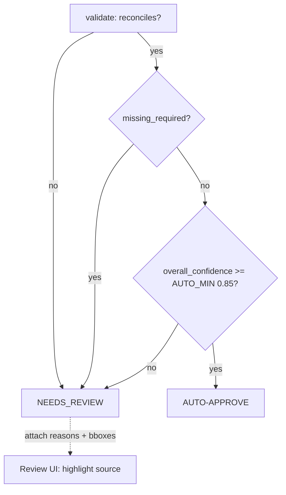

# Validation & Accuracy Evaluation

> **Project #4 — Invoice & Receipt Processing System** (`invoice_ai`). Author: Le Dinh Minh Quan (23127460).
> This document specifies the **KIE quality + validation audit** — the Document-AI analogue of a fairness/quality audit. It defines *what* we measure, *how* the analysis module computes it, and *how* the numeric thresholds (`ε`, `FIELD_CONF_MIN`, `AUTO_MIN`) drive the auto-approve vs. human-review decision. All metrics, datasets, and thresholds are consistent with the authoritative `DESIGN_BRIEF.md`.

---

## 1. Why a validation audit (not just a leaderboard F1)

A single "overall F1" hides exactly the failures that matter for money documents. The `O` (outside) tag dominates every token-classification dataset, so an inflated `overall_accuracy` can coexist with a **collapsed `TOTAL` class** — and `TOTAL` is the one field that flows into a financial ledger. Our evaluation therefore enforces three reporting rules from the brief:

1. **Always report per-entity P/R/F1**, never just `overall_*`, so rare-class collapse (e.g. `TOTAL`, `B-TOTAL`) is visible.
2. **Report needs-review rate broken down by reason**, not a single aggregate.
3. **Report latency p95 separately for GPU and CPU.**

The audit spans four layers, evaluated top to bottom: (a) token-level entity recognition, (b) post-normalization end-to-end field accuracy, (c) line-item structure, and (d) the **arithmetic validation gate** that no leaderboard captures.

---

## 2. Evaluation layers & how the analysis module computes them

### 2.1 Per-entity token-level F1 (seqeval, entity-level)

The layout extractor (`microsoft/layoutlmv3-base`, internal/accuracy; `SCUT-DLVCLab/lilt-roberta-en-base` for commercial) is scored with **entity-level seqeval**, not token accuracy. The analysis module strips all `-100` positions (continuation subwords + special tokens), maps ids back through `id2label`, and calls `evaluate.load("seqeval")`, keeping both `overall_*` **and** the per-entity block:

```python
import evaluate, numpy as np
seqeval = evaluate.load("seqeval")
def compute_metrics(p):
    preds = np.argmax(p.predictions, axis=2)
    true_pred = [[id2label[a] for a,l in zip(pr,lab) if l!=-100] for pr,lab in zip(preds,p.label_ids)]
    true_lab  = [[id2label[l] for a,l in zip(pr,lab) if l!=-100] for pr,lab in zip(preds,p.label_ids)]
    r = seqeval.compute(predictions=true_pred, references=true_lab)
    # KEEP per-entity keys (COMPANY/DATE/ADDRESS/TOTAL/...) — not only overall_*
    return r
```

Evaluated on each dataset's held-out test split: `mp-02/sroie` (test **347**, `S-`-tag scheme `S-COMPANY/S-DATE/S-ADDRESS/S-TOTAL/O`), `nielsr/funsd-layoutlmv3` (test **50**, BIO 7-class), with `naver-clova-ix/cord-v2` (test **100**) scored via field-F1 on the Donut path. Seqeval already discounts `O`; per-entity F1 exposes any rare class lagging.

### 2.2 End-to-end post-normalization field accuracy

Token F1 measures the *model*; field accuracy measures the *whole pipeline* (OCR -> extract -> normalize). The module flattens the final structured JSON to `{key: value}`, applies the same normalization as production (ISO-8601 dates, `Decimal(str(x))` 2dp money, ISO-4217 currency), and does **exact-match per field** against the gold record. This is where OCR errors and date-format ambiguity surface that the model F1 cannot see (a token correctly tagged `DATE` is still *wrong* end-to-end if `03/04/2026` normalized to the wrong month).

### 2.3 Line-item per-row / per-cell F1

For line items (the Donut path, `naver-clova-ix/donut-base-finetuned-cord-v2`, and the `extract_line_items` tool), the module computes:

- **Per-row F1** — rows matched on `(description, amount)`; a predicted row counts as a true positive only if both align to a gold row.
- **Per-cell F1** — independent exact-match F1 for `qty`, `unit_price`, `amount`. Per-cell scoring isolates *which* column degrades (qty mis-reads vs. amount mis-reads), which per-row F1 averages away.

The Donut path additionally reports normalized tree-edit-distance (**nTED**) over the flattened JSON tree.

### 2.4 Arithmetic validation pass-rate + needs-review-rate by reason

This is the layer unique to `invoice_ai` and absent from the reference. Over the test corpus the module reads each document's `ValidationReport` and computes:

- **Validation pass-rate** = fraction of docs where `reconciles AND required_present`.
- **Needs-review rate** = fraction routed to human review, **broken down by `review_reasons`** (not_reconcile / missing_required / low_confidence / low_ocr_conf / doc_type_other).

Reconciliation uses the brief's rules with tolerance `ε = max(0.01, 0.005 * total)`:

```
sum(item.amount) == subtotal           (±ε)
subtotal + tax   == total              (±ε)
tax ≈ subtotal * tax_rate              (±ε, if tax_rate present)
quantity * unit_price == amount        (±ε, per line, when both present)
```

---

## 3. Illustrative results (PROJECTED — not yet measured)

> **The tables below are clearly-marked *projected* numbers for report illustration only.** They are consistent with the brief's stated expectation ordering (regex ≪ bert+bbox < LiLT ≈ LayoutLMv3-base; Donut > token-cls for nested line-items) and the SROIE class-imbalance caveat (`TOTAL` rare). They are **not** measured outputs and must be replaced by real test-split runs before any claim is made.

### 3.1 Per-entity F1 on `mp-02/sroie` test (347 docs) — *projected*

| Entity | Support (tokens) | Precision | Recall | F1 | Note |
|---|---:|---:|---:|---:|---|
| `COMPANY` | high | 0.96 | 0.95 | 0.955 | text-block, easy |
| `DATE`    | med  | 0.93 | 0.91 | 0.920 | dd/mm ambiguity drags recall |
| `ADDRESS` | high | 0.92 | 0.90 | 0.910 | multi-line grouping |
| **`TOTAL`** | **low (rare)** | **0.88** | **0.82** | **0.850** | **rare-class — watch for collapse** |
| **overall (micro)** | — | 0.93 | 0.91 | **0.920** | hides `TOTAL` gap |

The point of exposing `TOTAL` separately: an overall F1 of 0.92 looks healthy, yet `TOTAL` recall is 10 points lower — and `TOTAL` is the field that posts to the ledger. If real runs show `TOTAL` F1 collapsing further, the brief's remedy applies: weighted `CrossEntropyLoss(ignore_index=-100)` / focal loss / oversample rare-entity docs.

### 3.2 Cross-model end-to-end field accuracy — *projected*

| System | DATE | INVOICE_NO | TOTAL | VENDOR | macro field-acc |
|---|---:|---:|---:|---:|---:|
| regex/heuristic (floor) | 0.71 | 0.74 | 0.80 | 0.65 | 0.73 |
| `bert-base-uncased` + bbox | 0.85 | 0.86 | 0.88 | 0.83 | 0.855 |
| `lilt-roberta-en-base` (MIT) | 0.92 | 0.93 | 0.93 | 0.91 | 0.923 |
| `layoutlmv3-base` (NC, internal) | 0.93 | 0.94 | 0.94 | 0.93 | 0.935 |

Ordering matches the brief: regex is the mandatory floor; `bert+bbox` isolates how much layout-pretraining actually buys; LiLT ≈ LayoutLMv3-base for flat fields (LiLT is the commercial-safe ship).

### 3.3 Line-item structure (Donut, `cord-v2` test 100) — *projected*

| Metric | Value | Definition |
|---|---:|---|
| Per-row F1 | 0.89 | rows matched on (description, amount) |
| Per-cell F1 — `qty` | 0.91 | exact-match |
| Per-cell F1 — `unit_price` | 0.87 | exact-match (OCR decimal errors) |
| Per-cell F1 — `amount` | 0.90 | exact-match |
| nTED | 0.93 | 1 − normalized tree-edit-distance |

### 3.4 Validation pass-rate & needs-review breakdown — *projected*

| Outcome | Share of corpus | Driver |
|---|---:|---|
| **Auto-approved** (D3) | 71% | reconciles + complete + `conf ≥ AUTO_MIN` |
| Needs review — totals don't reconcile | 11% | `|delta| > ε` |
| Needs review — missing required field | 6% | `invoice_number / date / total / issuer` null |
| Needs review — low field confidence | 7% | required field `conf < FIELD_CONF_MIN` |
| Needs review — low OCR confidence | 4% | `ocr_mean_conf < OCR_MIN` after `MAX_OCR_ATTEMPTS` |
| Routed out — `OTHER` doc-type | 1% | D1 stop |
| **Validation pass-rate** | **88%** | `reconciles AND required_present` |

---

## 4. Confusion & error analysis

The module attributes every end-to-end miss to one of four buckets so remediation is targeted rather than guessed:

| Error class | Symptom | Root cause | Mitigation (per brief) |
|---|---|---|---|
| **OCR-induced** | model tags the right token, value still wrong (`8`↔`B`, `0`↔`O`, dropped decimal) | OCR substitution on noisy/low-DPI scans | native-PDF text first; PaddleOCR primary, docTR fallback; deskew/denoise on retry; `OCR_MIN=0.70` gate |
| **Ambiguous dd/mm vs mm/dd dates** | `03/04/2026` normalized to wrong month | locale-blind parsing | `date_valid` flags ambiguous dates; locale hint from detected currency/country; future-date / absurdly-old sanity check |
| **Currency mis/no-detection** | amount correct, currency wrong or null | symbol absent / mixed symbols (`£/€/$/VND`) | `currency` check requires a symbol or ISO-4217 code; warning `"currency inferred from symbol"`; null currency -> review |
| **Rare-class collapse** | `TOTAL` recall << overall | `O` dominates; few `TOTAL` tokens | per-entity F1 surfaces it; weighted/focal loss; oversample rare-entity docs |

A confusion matrix over predicted-vs-gold entity tags is logged per test run; the dominant off-diagonal cells (typically `DATE`↔`O` and `TOTAL`↔`O` boundary leakage) drive which class gets loss-reweighting.

---

## 5. How thresholds drive auto-approve vs. review

The numeric thresholds are the audit's actuators. `overall_confidence` is a **conservative bottleneck** — the *minimum* over the doc-type confidence, OCR mean confidence, and every required-field confidence — so one shaky required field blocks auto-approval:

```
overall_confidence = min(doc_type_conf, ocr_mean_conf, min(required-field confidences))
ε = max(0.01, 0.005 * total)
```

| Threshold | Value | Role in the gate |
|---|---|---|
| `Q_MIN` | 0.45 | D1: below -> rescan / switch engine / deskew |
| `OCR_MIN` | 0.70 | D1: below after `MAX_OCR_ATTEMPTS`(=2) -> review |
| `FIELD_CONF_MIN` | 0.80 | D2: any required field below -> LLM fallback (if available) else review |
| `AUTO_MIN` | 0.85 | D3: `overall_confidence ≥ AUTO_MIN` required to auto-approve |
| `ε` | `max(0.01, 0.005*total)` | reconciliation tolerance — penny rounding, not real gaps |



**Worked tie-in.** On `INV-2024-077` (brief §3.6) all field confidences ≥ 0.90, but the printed `total=1,860.00` vs. `subtotal+tax=2,160.00` gives `reconcile_delta = -300.00` against `ε = max(0.01, 0.005×1,860) = 9.30`. Since `|-300| > 9.30`, `reconciles=False` -> D3 fails -> `NEEDS_REVIEW` with a bbox-tagged reason. The reference would coerce `1860.00` to a valid float and silently post a £300 error to revenue; our gate catches it. That single arithmetic check is the core value-add the leaderboard F1 never measures.

---

## 6. Reporting discipline

Every evaluation run emits: per-entity P/R/F1 (all classes, no `overall`-only summaries), end-to-end field accuracy post-normalization, line-item per-row + per-cell F1, validation pass-rate, needs-review rate **by reason**, and latency p50/p95 **split GPU vs CPU** (`/extract` 1-page image ~250-500 ms p95 GPU, ~0.8-1.5 s p95 CPU). Baselines (regex/heuristic, `bert+bbox`) are run on the identical test splits so every claimed gain is attributable. All illustrative numbers above are projected and must be overwritten by measured runs before publication.
